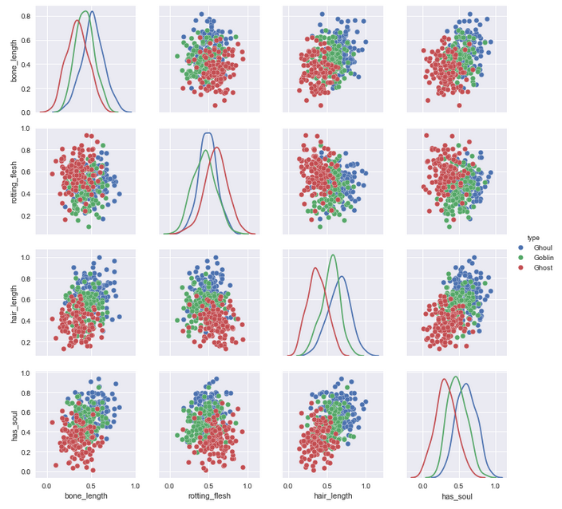
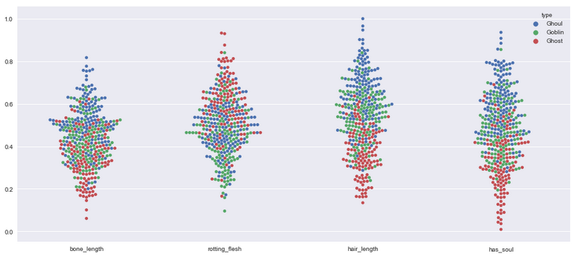
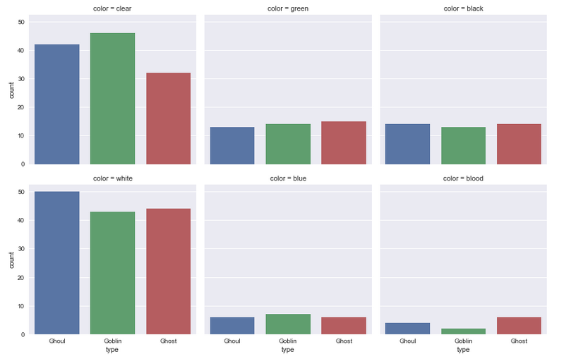

|  | 
|:--:| 

# Ghouls, Goblins, and Ghosts... Boo! ([Kaggle overview](https://www.kaggle.com/c/ghouls-goblins-and-ghosts-boo))

Fun machine learning project for 3 year olds and me

### submission.ipynb

This notebook develops and model to predict the labels of the test data

### analysis.ipynb

Looking through the data, we see that predictors look like overlapping gaussians.

|  | 
|:--:| 
| *Pair plot of all numeric variables showing the different gaussians* | 

Next we can get visualize the distributions from a different angle by using a swarm plot.  Nothing new is learned from this however.  The first plot was fairly conclusive that the predictors have the spread of three Gaussians.

|  | 
|:--:| 
| *Swarm plot showing the different distributions* | 

The only non numeric predictor in the dataset is color.  Below we can see the distributions of color.

|  | 
|:--:| 
| *The only categorical predictor, color* | 

From looking at all these variables we can see that each column has a different probability distribution for each type.
