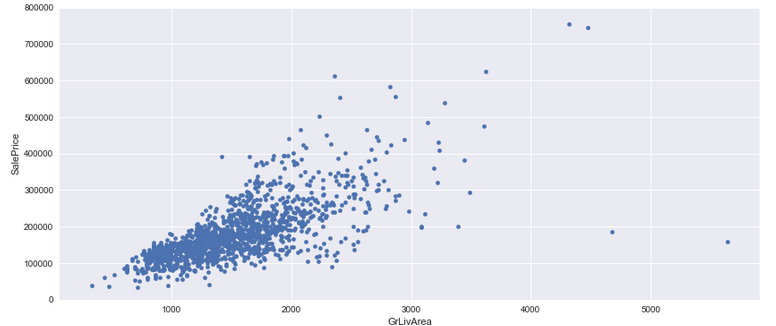

|  | 
|:--:| 

# High Score: 0.11558

### Submission

This submission was heavily inspired by Kaggle user [Serginne](https://www.kaggle.com/serigne) ([his work](https://www.kaggle.com/serigne/stacked-regressions-top-4-on-leaderboard)).

### Analysis

There are a lot of columns in this dataset, so it's a good idea to see how they relate with one another.  In this notebook, we get a better understanding of the distribution of the target, SalePrice and it's biggest predictors such as GrLivArea (above ground living area square feet).

### Logs

If for some reason you are so inclined, my iterations of success (or failure) are included in the logs
