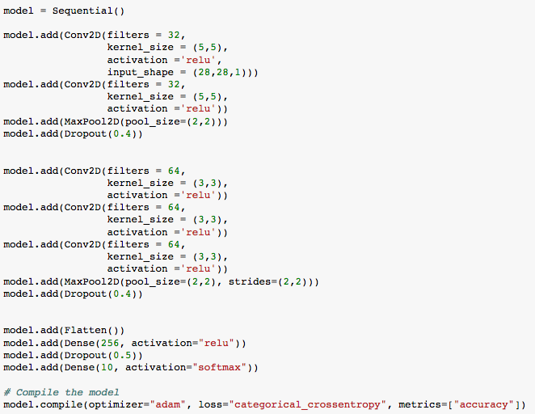
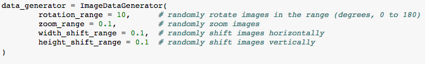
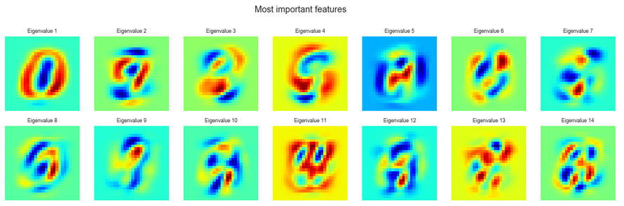

|  | 
|:--:| 

# High Score: 99.142% accuracy on Kaggle's test data

The "Hello World" of Neural Networks.  The MNIST dataset are tens of thousands of handwritten integers in the range [0, 9].

Included is an analysis notebook to get to know the data and a submission notebook that provides predictions.

### Submission

A 10 layer Keras model is constructed with adam optimizer.  Below is my code for the Neural Network.  Initially there was inspiration from Kaggler Yassine Ghouzam's [work](https://www.kaggle.com/yassineghouzam/introduction-to-cnn-keras-0-997-top-6) however I believe I was able to evolve from it.  I added a couple more Convolution layers and increased the Dropout rate and I've found more success.

|  | 
|:--:| 
| *My Neural Network architecture* |

Excess data is generated by rotating, shifting, and zooming original data.  See the image below for the actual code.

|  | 
|:--:| 
| *Image generator used* |

### Analysis

Supplementary analysis is provided that contains primary feature analysi and PCA of the data.

|  | 
|:--:| 

### Logs

If for some reason you are so inclined, my iterations of success (or failure) are included in the logs
