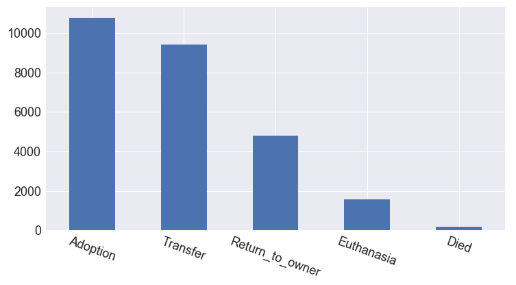
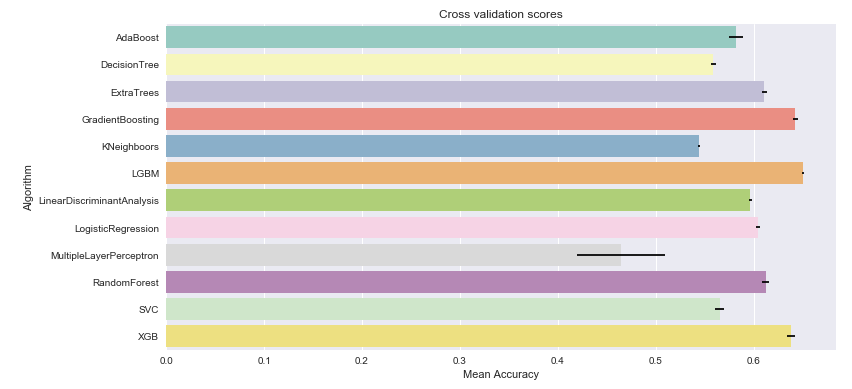
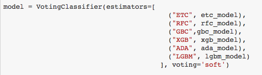

|  | 
|:--:| 

# Shelter Animal Outcomes ([Kaggle overview](https://www.kaggle.com/c/shelter-animal-outcomes))

### Introduction

Using a dataset of intake information including breed, color, sex, and age from the Austin Animal Center, I try to predict the outcome for each animal.

|  | 
|:--:| 
| *Different outcomes possible for shelter animals* |

### Full

This notebook contains both analysis and modeling scripts.  It contains everything you'd like to see.

The notebook begins with handling of categorical columns and feature selection.  And after all the data processing it ends with modeling.  The final model is an ensemble voting classifer and is choosen from the Cross Validation results of several models.

|  | 
|:--:| 
| *Many model results* |

I create a soft voting classifier from the top scoring models as seen below.

|  | 
|:--:| 
| *Make up of Voting Classifer* |

### Logs

If for some reason you are so inclined, my iterations of success (or failure) are included in the logs

