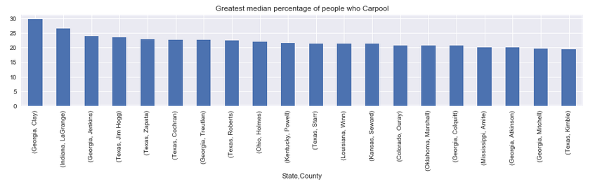

|  | 
|:--:| 
| *More Georgia and Texas than I was expecting* | 

# US Census Data ([Kaggle link](https://www.kaggle.com/muonneutrino/us-census-demographic-data))

This is a Dataset of the 2015 US Census data estimate.  Since there is no competition, this folder is just an exploration of the data.

### Analysis

The analysis is contained in different folders to try and stay organized

- state_focus:  Focuses mostly on how relationships between States.  What state is the most populated?  Which state has the lowest unemployment?

- race_focus: Focuses on the race columns.  Which State or County has the greatest representation of that race?  How does unemployment match up between the different races?

- fun: A lot of misc relationships and facts I didn't want to keep out.  What County has the longest name?

- general_focus: This notebook focuses on the data in general.  What are the missing values?  Do all percents add up to 100?
