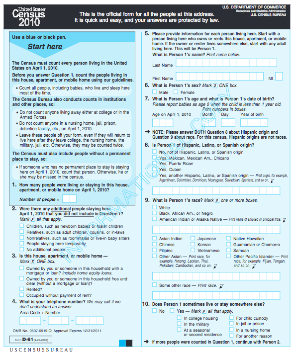
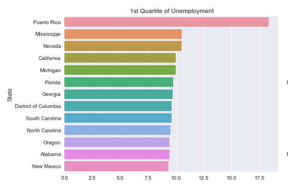
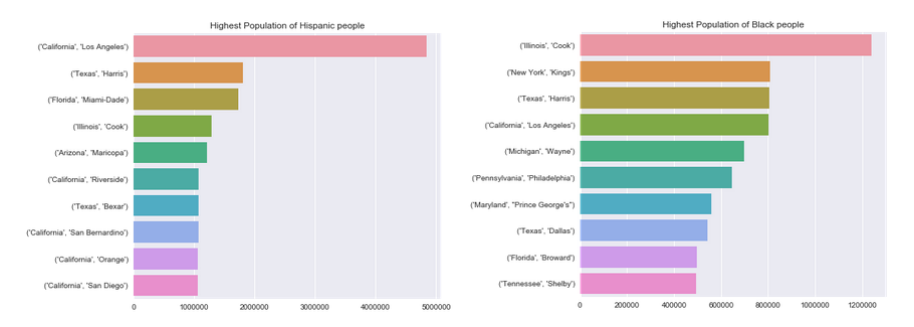
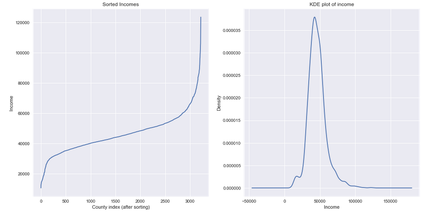
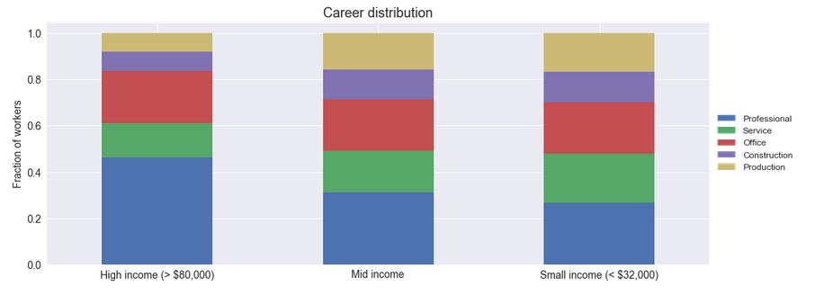
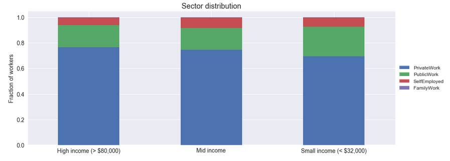
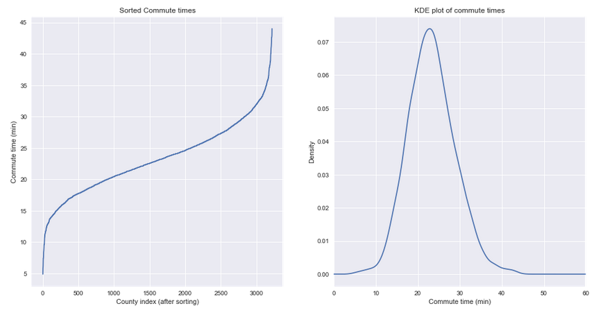
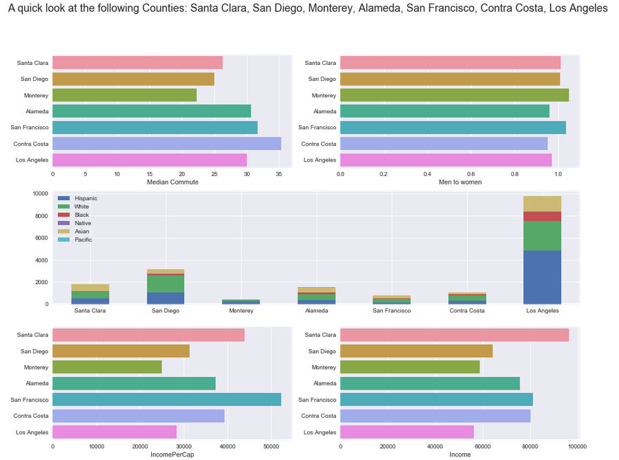

|  | 
|:--:| 
| *More Georgia and Texas than I was expecting* | 

# US Census Data ([Kaggle link](https://www.kaggle.com/muonneutrino/us-census-demographic-data))

This is a Dataset of the 2015 US Census data estimate.  Since there is no competition, this folder is just an exploration of the data.

The analysis is contained in different folders to try and stay organized.

# Table of Contents

1.) [Introduction](#intro)

   - [Background](#background)

   - [Tracts](#tracts)

   - [Questionnaire](#questionnaire)

   - [Dataset](#dataset)

2.) [State Focus](#state)

3.) [Racial Focus](#race)

4.) [Numeric Focus](#numeric)

   - [Income](#nu_income)

   - [Commute times](#nu_commute)

5.) [Focus on Fun!](#fun)

6.) [General Focus](#general)

## Introduction

#### Background

Every 10 years, the US government conducts a survey of the entire nation to get.

#### Tracts

Tracts are.  They range from _ to _ people

#### Questionnaire

|  | 
|:--:| 
| *The 2010 Census form ([photo](https://www.census.gov/history/pdf/2010questionnaire.pdf))* | 

#### Dataset

In the exact words of Kaggle user [Muon Neutrino](https://www.kaggle.com/muonneutrino), the individual who hosts this [dataset](https://www.kaggle.com/muonneutrino/us-census-demographic-data) on Kaggle

"""

The data here are taken from the DP03 and DP05 tables of the 2015 American Community Survey 5-year estimates. The full datasets and much more can be found at the American Factfinder [website](https://factfinder.census.gov/faces/nav/jsf/pages/index.xhtml). Currently, I include two data files:

    1.) census_tract.csv: Data for each census tract in the US, including DC and Puerto Rico.
    1.) census_county.csv: Data for each county or county equivalent in the US, including DC and Puerto Rico.

The two files have the same structure, with just a small difference in the name of the id column. Counties are political subdivisions, and the boundaries of some have been set for centuries. Census tracts, however, are defined by the census bureau and will have a much more consistent size. A typical census tract has around 5000 or so residents.

The Census Bureau updates the estimates approximately every year. At least some of the 2016 data is already available, so I will likely update this in the near future.

"""

## State Focus

Focuses mostly on how relationships between States.  What state is the most populated?  Which state has the lowest unemployment?

|  | 
|:--:| 
| *This data was collected before Hurrican Maria* | 

## Racial Focus

Focuses on the race columns.  Which State or County has the greatest representation of that race?  How does unemployment match up between the different races?

|  | 
|:--:| 
| *Highest Black and Hispanic populations (have you ever heard of Cook, Illinois?)* | 

## Numeric Focus

This notebook looks at the easily quantifiable columns and ignores labels like race, County, and State.

#### Income

To get a sense of 

|  | 
|:--:| 
| *Distribution of income* | 

Different

|  | 
|:--:| 
| *Distribution of careers based on income* | 

Furthermore we can see that the counties on the different ends of income have a different

|  | 
|:--:| 
| *Distribution of sector work based on income* | 

#### Commute times

The

|  | 
|:--:| 
| *Distribution of commute times* |

It would 

|  | 
|:--:| 
| *Distribution of transportation methods by commute time* |  

## Focus on Fun!

This notebook includes a lot of misc relationships and facts I didn't want to keep out.  The notebook contains a script that analyzes different selected counties.  The below graph looks at the counties with which I'm most familar.

|  | 
|:--:| 
| *Famous counties of the Bay Area and California* | 

## General Focus

This notebook focuses on the data in general.  What are the missing values?  Do all percents add up to 100?
