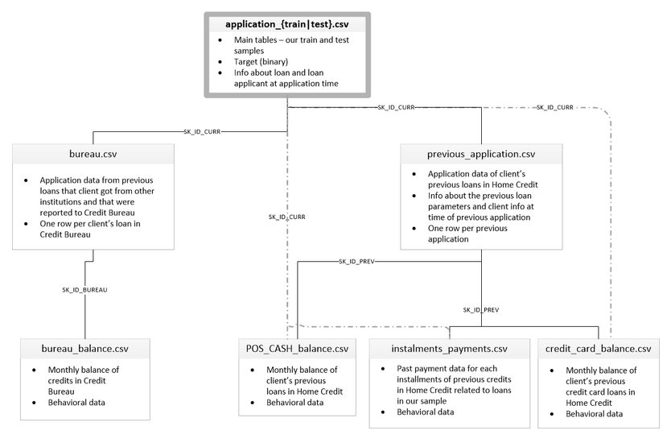

|  | 
|:--:| 

# Home Credit Default Risk ([Kaggle overview](https://www.kaggle.com/c/home-credit-default-risk))

### Analysis

The analysis notebook is a basic overview of the data with no attempt and predicting the target.

I suggest looking over this notebook before the submission notebook to become familar with the data.  It should also help explain some preprocessing I perform on the data.

This competition includes many datasets each of which has some relationship to the train and test data.  I suggest looking over the following graphic for a minute or so to understand the relationships.

|  | 
|:--:| 
| *Dataset Overview and Relationships* |

### Submission

The submission notebook contains the preprocessing of the data, target predictions, and some analysis

### Logs

If for some reason you are so inclined, my iterations of success (or failure) are included in the logs

